  <h1>Hello World, I'm Lucas Silva</h1>
  
<em>Crafting digital solutions that bridge innovation and business impact</em>

 

  

 

  

 

  

 

  

 

<strong>More about me</strong>

 

I specialize in creating robust web systems that solve real-world challenges.
With a strong focus on technical excellence and business impact, I am growing toward a Tech Lead role and building products that improve how people interact with technology.

**Focus areas:** Full-Stack Development, Clean Architecture, Team Leadership, System Design

---

## Tech Stack

### Frontend Development

   
   
   
   

### Backend Development

   
   
   
   
   

### Database and Tools

   
   
   
   
   
   
   
   

---

## GitHub Analytics

 

 

---

## Currently Exploring

  
   
  
   
  
   
  

---

## Connect

  
  

 

  

